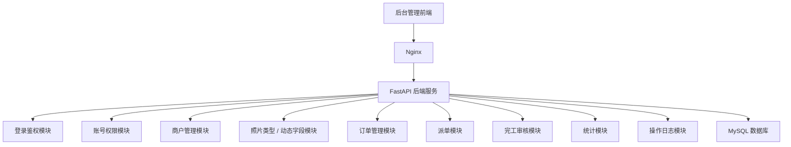
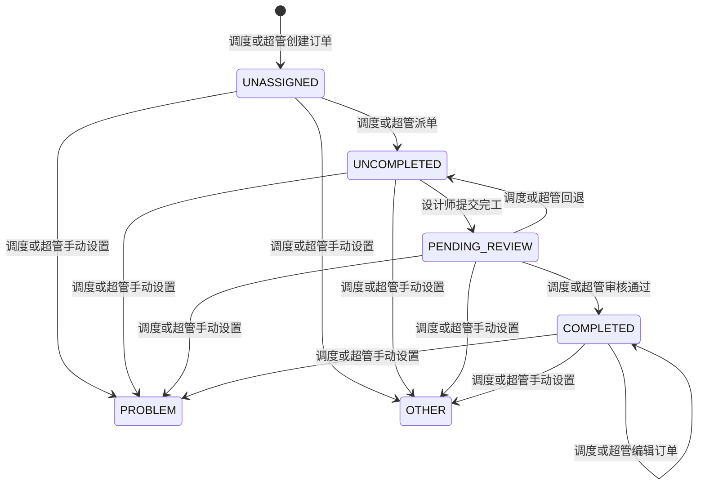

# 设计派单管理系统开发文档（Python 版）

## 1. 文档信息

- 项目名称：设计派单管理系统
- 文档类型：后端开发文档
- 技术方案：Python FastAPI 版
- 文档版本：v1.0
- 编写日期：2026-04-24
- 适用对象：客户、前端开发、后端开发、测试、部署人员
- 系统定位：用于设计订单建单、派单、完工提交、调度审核和账号权限管理的后台系统

## 2. 项目目标

本系统用于管理设计类订单的完整业务流程。调度人员可以创建商户、维护商户客户、配置照片类型及默认接单价和派单价、创建订单，并在派单环节分配设计师；设计师只处理分配给自己的订单，并提交完工；调度或超级管理员审核通过后，订单进入已完工状态；超级管理员负责账号管理和全局业务管理。

Python 版第一版目标是快速完成核心业务闭环，保证登录权限、数据隔离、订单状态流转、动态字段、分页查询和基础日志可通过验收。系统采用轻量化后端架构，适合当前 100 人左右、每月几百到一千多条订单数据的业务体量。

## 3. 已确认需求范围

### 3.1 交付原则

第一版按照甲方确认的验收标准进行开发和交付。开发目标是让核心业务流程可正常使用，重点保证登录权限、账号管理、商户和照片类型配置、订单建单、派单、设计师提交完工、调度审核、状态回退和基础查询功能可通过验收。

第一版不追求复杂架构和额外扩展功能，文档中涉及的后期扩展方向仅作为技术预留，不计入当前报价和验收范围。

### 3.2 用户角色

系统包含三类角色：

| 角色 | 说明 |
| --- | --- |
| 设计师 | 只能查看分配给自己的订单，可以提交完工，可以修改本人密码 |
| 调度 | 可以管理商户、客户、照片类型、订单、派单、审核、回退，可以修改本人密码 |
| 超级管理员 | 拥有调度全部业务权限，额外可以创建、编辑、删除账号和重置所有账号密码 |

权限约束：

- 系统不提供公开注册功能。
- 调度不能创建设计师账号。
- 调度不能修改设计师账号密码。
- 只有超级管理员可以创建、编辑、删除账号和重置账号密码。
- 设计师和调度账号必须由超级管理员创建，创建完成后才能登录系统并自行修改本人密码。
- 超级管理员账号系统内只能存在一个，由部署初始化脚本创建。
- 超级管理员首次登录后，可以通过个人设置修改自己的密码。
- 设计师只能查看和操作自己的订单数据。

### 3.3 订单规则

- 一个订单只能派发给一个设计师。
- 订单号或订单编号由调度或超级管理员手动录入，系统不自动生成。
- 订单号必须填写，并且建议保持唯一，避免后续查询和对账混乱。
- 建单时不选择设计师，订单的 `designer_id` 为空。
- 调度或超级管理员创建订单后，订单状态为未派单。
- 调度或超级管理员派单后，订单进入未完成状态，并展示到设计师表格。
- 设计师点击完工后，订单进入待审核状态。
- 调度或超级管理员确认完工后，订单变为已完工状态。
- 已完工订单仍允许调度和超级管理员编辑，编辑后状态保持已完工，但商户名称和照片类型不允许修改。
- 调度或超级管理员可以将待审核订单回退为未完成。
- 调度或超级管理员可以手动将订单状态修改为问题件或其他。
- 删除采用物理删除，不做业务数据备份。
- 删除操作仍建议记录操作日志，用于保留基本追溯信息。

### 3.4 动态字段规则

- 文档中的“店铺”对应甲方口径中的“商户”。
- 每家商户可以配置不同的照片类型。
- 每个照片类型需要配置默认接单价和默认派单价。
- 照片类型通过接口动态新增、编辑和删除。
- 商户下面可以维护多个客户或客人信息，客户信息至少包含客户信息和照片张数。
- 创建订单时，系统根据所选商户加载该商户下的客户列表，再根据照片类型带出默认接单价和默认派单价。
- 订单保存后，需要保留当时的字段名称和值，避免后续字段配置变更影响历史订单展示。

### 3.5 订单展示字段规则

主页第一种表格为订单明细表，设计师和调度看到的字段不同。

设计师表格需要展示：

- 商户名称。
- 照片类型。
- 状态。
- 设计师。
- 订单号。
- 照片张数。
- 客户信息。
- 备注。
- 下单时间。

调度表格需要展示：

- 商户名称。
- 照片类型。
- 状态。
- 设计师。
- 订单号。
- 照片张数。
- 接单价。
- 接单价合计，按照片张数乘以接单价计算。
- 派单价。
- 派单价合计，按照片张数乘以派单价计算。
- 客户信息。
- 备注。
- 下单时间。
- 完工时间。

组合筛选：

- 商户名称。
- 照片类型。
- 状态。
- 设计师。
- 时间范围。
- 关键词。

主页第二种表格为调度汇总表，调度和超级管理员可查看，需要展示：

- 商户名称。
- 订单数量。
- 照片张数。
- 接单总价，按符合筛选条件的数据汇总 `照片张数 x 接单价`。
- 派单总价，按符合筛选条件的数据汇总 `照片张数 x 派单价`。
- 利润，按接单总价减派单总价计算。
- 订单时间。

导出规则：

- 调度和超级管理员可以导出。
- 导出内容按照当前选择的表格类型、筛选条件、表头字段生成。

### 3.6 不包含范围

第一版暂不包含以下能力：

- 附件上传。
- 图片上传。
- 文件管理。
- 移动端适配。
- 第三方系统对接。
- 复杂报表分析。
- 消息通知。
- 微服务拆分。

## 4. 数据量与性能预估

当前预估使用规模：

- 使用人数：约 100 人。
- 月数据量：几百到一千多条订单。
- 年数据量：约几千到一两万条订单。

该数据量使用 FastAPI 单体后端加 MySQL 即可稳定支撑。系统性能重点不在复杂分布式架构，而在分页查询、索引设计、权限过滤、状态流转一致性和数据库备份。

性能策略：

- 所有列表接口必须分页。
- 订单列表默认每页 10 或 20 条，最大建议不超过 100 条。
- 常用查询字段建立索引。
- 动态字段详情按需加载。
- 首页统计只统计必要数据。
- 操作日志按时间倒序分页查询。

## 5. 技术架构

### 5.1 架构类型

采用 Python FastAPI 模块化单体后端架构。

该架构适合当前业务规模，开发速度快、部署轻量、接口文档生成方便，也方便后期在现有模块基础上继续扩展。

### 5.2 技术栈

| 类型 | 技术 |
| --- | --- |
| 后端框架 | FastAPI |
| Python 版本 | Python 3.12 |
| ASGI 服务 | Uvicorn |
| 生产进程管理 | systemd 管理 Uvicorn 多 worker |
| 数据库 | MySQL 8 |
| 数据库驱动 | PyMySQL |
| ORM | SQLAlchemy 2.x 同步 ORM |
| 数据库迁移 | Alembic |
| 数据校验 | Pydantic v2 |
| 登录认证 | PyJWT |
| 密码加密 | bcrypt |
| 接口文档 | FastAPI 自带 Swagger UI 和 OpenAPI |
| 配置管理 | pydantic-settings |
| 跨域处理 | FastAPI CORSMiddleware |
| 日志 | Python 标准 logging |
| 表格导出 | openpyxl |
| 部署 | Nginx + systemd + Uvicorn + MySQL |
| 依赖管理 | pip + requirements.txt |
| 测试框架 | pytest |

第一版暂不强依赖 Redis、消息队列、搜索引擎、对象存储和微服务组件。

### 5.3 选型依据

本技术栈按官方文档和当前项目体量确定：

- FastAPI 官方文档支持使用 Uvicorn 多 worker 方式部署生产服务，本项目采用 `systemd + Uvicorn --workers` 管理后端进程。
- FastAPI 官方教程提供 SQL 关系型数据库集成方式，本项目使用 MySQL 作为关系型数据库。
- SQLAlchemy 2.x 是 Python 生态中成熟的 ORM，本项目使用同步 ORM 降低开发复杂度。
- Alembic 是 SQLAlchemy 官方体系内常用的数据库迁移工具，本项目使用 Alembic 管理表结构变更。
- Pydantic v2 和 pydantic-settings 用于请求数据校验和环境配置管理。
- PyJWT 用于生成和解析 JWT，bcrypt 用于密码哈希。
- openpyxl 用于生成 `.xlsx` 导出文件，满足调度和超级管理员导出当前表格数据的需求。

### 5.4 系统架构图



## 6. 后端模块设计

| 模块 | 职责 |
| --- | --- |
| 登录鉴权模块 | 登录、刷新 Token、退出、当前用户信息、JWT 校验、本人改密 |
| 账号权限模块 | 超级管理员管理账号、角色、状态、密码重置 |
| 商户管理模块 | 商户新增、编辑、删除、查询 |
| 商户客户模块 | 商户下客户或客人信息新增、编辑、删除、查询 |
| 照片类型模块 | 照片类型新增、编辑、删除、查询 |
| 动态字段模块 | 动态字段定义、默认值配置、订单字段值保存 |
| 订单管理模块 | 建单、订单列表、详情、编辑、删除、订单号唯一校验 |
| 派单模块 | 调度或超级管理员将订单派发或改派给设计师 |
| 完工审核模块 | 设计师提交完工、调度或超级管理员审核通过、回退 |
| 统计模块 | 首页统计、表头详情弹窗统计 |
| 操作日志模块 | 记录关键操作，用于问题追踪 |

## 7. 后端文件结构建议

```text
design-dispatch-api
├─ app
│  ├─ main.py
│  │
│  ├─ core
│  │  ├─ config.py
│  │  ├─ database.py
│  │  ├─ security.py
│  │  ├─ permissions.py
│  │  └─ exceptions.py
│  │
│  ├─ api
│  │  ├─ router.py
│  │  ├─ auth.py
│  │  ├─ users.py
│  │  ├─ shops.py
│  │  ├─ product_types.py
│  │  ├─ orders.py
│  │  ├─ statistics.py
│  │  └─ logs.py
│  │
│  ├─ models
│  │  ├─ user.py
│  │  ├─ shop.py
│  │  ├─ shop_customer.py
│  │  ├─ product_type.py
│  │  ├─ product_type_field.py
│  │  ├─ order.py
│  │  ├─ order_field_value.py
│  │  ├─ order_status_log.py
│  │  └─ operation_log.py
│  │
│  ├─ schemas
│  │  ├─ common.py
│  │  ├─ auth.py
│  │  ├─ user.py
│  │  ├─ shop.py
│  │  ├─ shop_customer.py
│  │  ├─ product_type.py
│  │  ├─ order.py
│  │  ├─ statistics.py
│  │  └─ log.py
│  │
│  ├─ services
│  │  ├─ auth_service.py
│  │  ├─ user_service.py
│  │  ├─ shop_service.py
│  │  ├─ shop_customer_service.py
│  │  ├─ product_type_service.py
│  │  ├─ order_service.py
│  │  ├─ statistics_service.py
│  │  └─ log_service.py
│  │
│  └─ utils
│     ├─ response.py
│     ├─ pagination.py
│     └─ validators.py
│
├─ alembic
│  ├─ versions
│  └─ env.py
│
├─ scripts
│  ├─ init_admin.py
│  └─ backup_mysql.sh
│
├─ tests
│  ├─ test_auth.py
│  ├─ test_orders.py
│  └─ test_permissions.py
│
├─ .env.example
├─ alembic.ini
├─ requirements.txt
└─ README.md
```

## 8. 数据库表设计

Python 版数据库结构与业务设计保持一致，数据库仍使用 MySQL。

### 8.1 用户表 `users`

| 字段 | 类型建议 | 说明 |
| --- | --- | --- |
| id | bigint | 主键 |
| username | varchar(50) | 登录账号，唯一 |
| password_hash | varchar(100) | 密码加密值 |
| real_name | varchar(50) | 用户姓名 |
| role | varchar(30) | DESIGNER / DISPATCHER / ADMIN |
| phone | varchar(30) | 手机号，可空 |
| status | varchar(20) | ENABLED / DISABLED |
| token_version | int | Token 版本号，默认 0，修改或重置密码时递增 |
| last_login_at | datetime | 最近登录时间 |
| created_at | datetime | 创建时间 |
| updated_at | datetime | 更新时间 |

索引：

- `uk_users_username`：唯一索引，字段 `username`
- `idx_users_role`：普通索引，字段 `role`

### 8.2 商户表 `shops`

说明：表名保留 `shops`，页面展示和业务话术可以使用“商户”。

| 字段 | 类型建议 | 说明 |
| --- | --- | --- |
| id | bigint | 主键 |
| shop_name | varchar(100) | 商户名称 |
| owner_name | varchar(50) | 商户负责人，可空 |
| contact_phone | varchar(30) | 联系方式，可空 |
| remark | varchar(500) | 备注 |
| created_at | datetime | 创建时间 |
| updated_at | datetime | 更新时间 |

索引：

- `idx_shops_name`：普通索引，字段 `shop_name`

### 8.3 商户客户表 `shop_customers`

用于维护每个商户下面的客户或客人信息，后续建单时从该商户的客户列表中选择。

| 字段 | 类型建议 | 说明 |
| --- | --- | --- |
| id | bigint | 主键 |
| shop_id | bigint | 所属商户 ID |
| customer_name | varchar(100) | 客户或客人名称 |
| photo_count | int | 默认照片张数 |
| remark | varchar(500) | 备注 |
| created_at | datetime | 创建时间 |
| updated_at | datetime | 更新时间 |

索引：

- `idx_shop_customers_shop_id`：普通索引，字段 `shop_id`
- `idx_shop_customers_name`：普通索引，字段 `customer_name`

### 8.4 照片类型表 `product_types`

说明：表名保留 `product_types`，页面展示和业务话术可以使用“照片类型”。

| 字段 | 类型建议 | 说明 |
| --- | --- | --- |
| id | bigint | 主键 |
| shop_id | bigint | 所属商户 ID |
| type_name | varchar(100) | 照片类型名称 |
| default_accept_price | decimal(10,2) | 默认接单价 |
| default_dispatch_price | decimal(10,2) | 默认派单价 |
| sort_order | int | 排序 |
| created_at | datetime | 创建时间 |
| updated_at | datetime | 更新时间 |

索引：

- `idx_product_types_shop_id`：普通索引，字段 `shop_id`

### 8.5 动态字段定义表 `product_type_fields`

| 字段 | 类型建议 | 说明 |
| --- | --- | --- |
| id | bigint | 主键 |
| product_type_id | bigint | 所属照片类型 ID |
| field_key | varchar(50) | 字段标识 |
| field_label | varchar(100) | 字段名称 |
| field_type | varchar(30) | TEXT / TEXTAREA / NUMBER / DATE / SELECT |
| required | tinyint | 是否必填 |
| default_value | varchar(1000) | 默认值 |
| options_json | text | 选项 JSON，SELECT 类型使用 |
| sort_order | int | 排序 |
| created_at | datetime | 创建时间 |
| updated_at | datetime | 更新时间 |

索引：

- `idx_fields_product_type_id`：普通索引，字段 `product_type_id`

### 8.6 订单主表 `orders`

| 字段 | 类型建议 | 说明 |
| --- | --- | --- |
| id | bigint | 主键 |
| order_no | varchar(50) | 订单号，调度或超级管理员手动录入，建议唯一 |
| shop_id | bigint | 商户 ID |
| customer_id | bigint | 商户客户 ID |
| product_type_id | bigint | 照片类型 ID |
| customer_info_snapshot | varchar(500) | 客户信息快照 |
| photo_count | int | 照片张数 |
| accept_unit_price | decimal(10,2) | 接单价 |
| accept_total_amount | decimal(10,2) | 接单价合计，照片张数 x 接单价 |
| dispatch_unit_price | decimal(10,2) | 派单价 |
| dispatch_total_amount | decimal(10,2) | 派单价合计，照片张数 x 派单价 |
| designer_id | bigint | 派单设计师 ID，建单时为空，派单时写入 |
| status | varchar(30) | UNASSIGNED / UNCOMPLETED / PENDING_REVIEW / COMPLETED / PROBLEM / OTHER |
| requirement_text | text | 设计要求 |
| remark | varchar(1000) | 备注 |
| created_by | bigint | 建单人 ID |
| updated_by | bigint | 最近修改人 ID |
| ordered_at | datetime | 下单时间 |
| submitted_at | datetime | 设计师提交完工时间 |
| reviewed_at | datetime | 审核时间 |
| dispatched_at | datetime | 派送时间 |
| completed_at | datetime | 完工时间 |
| created_at | datetime | 创建时间 |
| updated_at | datetime | 更新时间 |

索引：

- `uk_orders_order_no`：唯一索引，字段 `order_no`
- `idx_orders_status`：普通索引，字段 `status`
- `idx_orders_designer_id`：普通索引，字段 `designer_id`
- `idx_orders_shop_id`：普通索引，字段 `shop_id`
- `idx_orders_customer_id`：普通索引，字段 `customer_id`
- `idx_orders_product_type_id`：普通索引，字段 `product_type_id`
- `idx_orders_ordered_at`：普通索引，字段 `ordered_at`
- `idx_orders_completed_at`：普通索引，字段 `completed_at`
- `idx_orders_created_at`：普通索引，字段 `created_at`

### 8.7 订单动态字段值表 `order_field_values`

| 字段 | 类型建议 | 说明 |
| --- | --- | --- |
| id | bigint | 主键 |
| order_id | bigint | 订单 ID |
| field_id | bigint | 动态字段定义 ID |
| field_key | varchar(50) | 字段标识快照 |
| field_label | varchar(100) | 字段名称快照 |
| field_value | text | 字段值 |
| sort_order | int | 排序 |
| created_at | datetime | 创建时间 |
| updated_at | datetime | 更新时间 |

索引：

- `idx_order_field_values_order_id`：普通索引，字段 `order_id`

### 8.8 订单状态日志表 `order_status_logs`

| 字段 | 类型建议 | 说明 |
| --- | --- | --- |
| id | bigint | 主键 |
| order_id | bigint | 订单 ID |
| before_status | varchar(30) | 操作前状态 |
| after_status | varchar(30) | 操作后状态 |
| action_type | varchar(30) | ASSIGN / SUBMIT / APPROVE / REJECT / ROLLBACK |
| operator_id | bigint | 操作人 ID |
| remark | varchar(1000) | 备注或回退原因 |
| created_at | datetime | 操作时间 |

索引：

- `idx_status_logs_order_id`：普通索引，字段 `order_id`
- `idx_status_logs_created_at`：普通索引，字段 `created_at`

### 8.9 操作日志表 `operation_logs`

| 字段 | 类型建议 | 说明 |
| --- | --- | --- |
| id | bigint | 主键 |
| operator_id | bigint | 操作人 ID |
| operator_role | varchar(30) | 操作人角色 |
| action_type | varchar(50) | 操作类型 |
| target_type | varchar(50) | 操作对象类型 |
| target_id | bigint | 操作对象 ID |
| target_name | varchar(200) | 操作对象名称或编号 |
| content | varchar(1000) | 操作说明 |
| created_at | datetime | 操作时间 |

索引：

- `idx_operation_logs_operator_id`：普通索引，字段 `operator_id`
- `idx_operation_logs_target`：普通索引，字段 `target_type, target_id`
- `idx_operation_logs_created_at`：普通索引，字段 `created_at`

## 9. 鉴权和权限设计

### 9.1 鉴权组成

Python 版鉴权不使用 Spring Security，采用以下方式实现：

```text
JWT 登录认证 + FastAPI Depends 权限依赖 + 角色权限校验 + 数据权限校验
```

JWT 负责识别“当前用户是谁”，角色权限负责判断“当前用户能访问哪些接口”，数据权限负责判断“当前用户能查看或操作哪些数据”。

系统不提供公开注册接口。唯一超级管理员账号由部署初始化脚本创建，设计师账号和调度账号由超级管理员在账号管理中创建。

### 9.2 JWT 认证

登录成功后返回：

```json
{
  "access_token": "xxx",
  "refresh_token": "yyy",
  "token_type": "Bearer",
  "expires_in": 7200
}
```

前端请求接口时在请求头携带：

```http
Authorization: Bearer xxx
```

系统采用双 Token：

- `access_token`：短期访问 Token，用于访问业务接口，建议有效期 2 小时。
- `refresh_token`：长期刷新 Token，用于刷新 access_token，建议有效期 7 天。

JWT 中建议包含：

- 用户 ID。
- 登录账号。
- 用户角色。
- 过期时间。
- Token 类型，区分 `access` 和 `refresh`。
- Token 版本号 `token_version`。

前端访问业务接口时只携带 `access_token`。当 `access_token` 过期时，前端调用 `/api/auth/refresh`，使用 `refresh_token` 换取新的 `access_token` 和 `refresh_token`，从而保持登录状态。

第一版不引入 Redis token 黑名单。退出登录由前端清除本地 Token 即可。用户修改本人密码或超级管理员重置密码时，后端递增用户表的 `token_version`，使旧 Token 在下次校验或刷新时失效。

### 9.3 角色权限

接口权限通过 FastAPI 依赖函数或装饰器实现。

示例规则：

| 接口 | 允许角色 |
| --- | --- |
| `/api/users` | 超级管理员 |
| `/api/shops` | 调度、超级管理员 |
| `/api/product-types` | 调度、超级管理员 |
| `/api/orders` | 设计师、调度、超级管理员 |
| `/api/orders/{id}/assign` | 调度、超级管理员 |
| `/api/orders/{id}/submit` | 设计师 |
| `/api/orders/{id}/review` | 调度、超级管理员 |

### 9.4 数据权限

设计师访问订单数据时，必须在后端强制过滤：

```text
WHERE designer_id = 当前用户 ID
```

订单详情、提交完工等接口也必须校验订单是否属于当前设计师，不能只依赖前端隐藏按钮。

## 10. 订单状态流转

订单状态：

| 状态 | 说明 |
| --- | --- |
| UNASSIGNED | 未派单，调度已创建订单但未分配设计师 |
| UNCOMPLETED | 未完成，调度已派单给设计师但设计师未提交完工 |
| PENDING_REVIEW | 待审核 |
| COMPLETED | 已完工 |
| PROBLEM | 问题件，调度或超级管理员手动设置 |
| OTHER | 其他，调度或超级管理员手动设置 |

状态流转：



规则说明：

- 设计师只能将本人未完成订单提交为待审核。
- 设计师不能审核、回退或编辑订单。
- 调度和超级管理员可以审核、回退、编辑订单，并手动设置问题件或其他状态。
- 已完工订单允许编辑，但编辑不改变订单状态，且不允许修改商户名称和照片类型。
- 每次状态变化都写入 `order_status_logs`。

## 11. 接口设计

接口统一前缀：

```text
/api
```

接口返回格式：

```json
{
  "code": 0,
  "message": "success",
  "data": {}
}
```

分页返回格式：

```json
{
  "code": 0,
  "message": "success",
  "data": {
    "records": [],
    "total": 0,
    "pageNo": 1,
    "pageSize": 20
  }
}
```

### 11.1 登录鉴权

| 序号 | 方法 | 路径 | 说明 |
| --- | --- | --- | --- |
| 1 | POST | `/api/auth/login` | 登录 |
| 2 | POST | `/api/auth/refresh` | 使用 refresh_token 刷新登录状态 |
| 3 | POST | `/api/auth/logout` | 退出登录 |
| 4 | GET | `/api/auth/me` | 获取当前用户信息、角色和菜单 |
| 5 | PUT | `/api/auth/password` | 修改本人密码 |

### 11.2 账号管理

账号管理接口仅超级管理员可访问。

| 序号 | 方法 | 路径 | 说明 |
| --- | --- | --- | --- |
| 6 | GET / POST | `/api/users` | 账号列表、创建账号 |
| 7 | PUT / DELETE | `/api/users/{id}` | 编辑账号、删除账号 |
| 8 | PUT | `/api/users/{id}/password` | 重置账号密码 |

### 11.3 商户管理

| 序号 | 方法 | 路径 | 说明 |
| --- | --- | --- | --- |
| 9 | GET / POST | `/api/shops` | 商户列表、创建商户 |
| 10 | PUT / DELETE | `/api/shops/{id}` | 编辑商户、删除商户 |
| 11 | GET / POST | `/api/shops/{id}/customers` | 商户客户列表、创建商户客户 |
| 12 | PUT / DELETE | `/api/shop-customers/{id}` | 编辑商户客户、删除商户客户 |

### 11.4 照片类型和动态字段

| 序号 | 方法 | 路径 | 说明 |
| --- | --- | --- | --- |
| 13 | GET / POST | `/api/product-types` | 照片类型列表、创建照片类型和动态字段 |
| 14 | PUT / DELETE | `/api/product-types/{id}` | 编辑照片类型和动态字段、删除照片类型 |
| 15 | GET | `/api/product-types/{id}/fields` | 获取照片类型动态字段 |

### 11.5 订单管理

| 序号 | 方法 | 路径 | 说明 |
| --- | --- | --- | --- |
| 16 | GET / POST | `/api/orders` | 订单明细列表、创建订单，列表支持分页、商户、照片类型、状态、设计师、时间和关键词组合筛选 |
| 17 | GET / PUT / DELETE | `/api/orders/{id}` | 订单详情、编辑订单、删除订单 |
| 18 | GET | `/api/orders/summary` | 调度汇总表，调度和超级管理员可访问 |
| 19 | GET | `/api/orders/export` | 导出当前表格数据，调度和超级管理员可访问 |

### 11.6 派单和审核

为减少接口数量，审核通过和回退可以合并为一个状态操作接口。

| 序号 | 方法 | 路径 | 说明 |
| --- | --- | --- | --- |
| 20 | PUT | `/api/orders/{id}/assign` | 派单或改派设计师 |
| 21 | PUT | `/api/orders/{id}/submit` | 设计师提交完工 |
| 22 | PUT | `/api/orders/{id}/review` | 审核通过、回退、设置问题件或其他 |

`/api/orders/{id}/review` 请求示例：

```json
{
  "action": "APPROVE",
  "reason": ""
}
```

`action` 可选值：

| 值 | 说明 |
| --- | --- |
| APPROVE | 审核通过，订单变为已完工 |
| REJECT | 审核不通过，订单回退为未完成 |
| SET_PROBLEM | 调度或超级管理员手动设置为问题件 |
| SET_OTHER | 调度或超级管理员手动设置为其他 |

### 11.7 统计和日志

| 序号 | 方法 | 路径 | 说明 |
| --- | --- | --- | --- |
| 23 | GET | `/api/statistics/overview` | 首页统计 |
| 24 | GET | `/api/statistics/header` | 字段详情弹窗数据 |
| 25 | GET | `/api/logs` | 操作日志列表 |

第一版按接口路径和业务功能口径统计约 25 个接口组，符合 10-25 个左右的沟通范围。开发落地时，部分接口会按 HTTP 方法拆分为列表、新增、编辑、删除等操作，但对外沟通仍按本节接口组统计。

## 12. 权限矩阵

| 功能 | 设计师 | 调度 | 超级管理员 |
| --- | --- | --- | --- |
| 登录 | 是 | 是 | 是 |
| 修改本人密码 | 是 | 是 | 是 |
| 查看本人订单 | 是 | 是 | 是 |
| 查看全部订单 | 否 | 是 | 是 |
| 创建订单 | 否 | 是 | 是 |
| 编辑订单 | 否 | 是 | 是 |
| 删除订单 | 否 | 是 | 是 |
| 派单 / 改派 | 否 | 是 | 是 |
| 提交完工 | 仅本人订单 | 否 | 否 |
| 审核完工 | 否 | 是 | 是 |
| 回退订单状态 | 否 | 是 | 是 |
| 手动设置问题件 / 其他 | 否 | 是 | 是 |
| 导出表格 | 否 | 是 | 是 |
| 商户管理 | 否 | 是 | 是 |
| 商户客户管理 | 否 | 是 | 是 |
| 照片类型管理 | 否 | 是 | 是 |
| 账号管理 | 否 | 否 | 是 |
| 重置账号密码 | 否 | 否 | 是 |
| 查看操作日志 | 否 | 是 | 是 |

## 13. 关键业务流程

### 13.1 登录流程

1. 用户输入账号和密码。
2. 后端校验账号是否存在、密码是否正确、账号是否启用。
3. 登录成功后返回 `access_token`、`refresh_token` 和用户信息。
4. 前端使用 `access_token` 访问业务接口，`access_token` 过期后使用 `refresh_token` 调用刷新接口保持登录状态。
5. 前端根据角色展示对应菜单。
6. 后端接口根据 JWT 中的用户身份、角色和 Token 版本号再次校验权限。

### 13.2 创建商户、客户和照片类型流程

1. 调度或超级管理员创建商户。
2. 为商户维护客户或客人信息。
3. 为商户创建照片类型。
4. 为照片类型配置默认接单价、默认派单价、动态字段和排序。
5. 后续建单时，根据商户加载客户列表和照片类型，根据照片类型带出默认价格。

### 13.3 建单流程

1. 调度或超级管理员进入建单页面。
2. 选择商户。
3. 系统加载该商户下的客户列表和照片类型。
4. 选择客户和照片类型。
5. 系统带出客户信息、照片张数、照片类型默认接单价和默认派单价。
6. 用户补充订单号、下单时间、备注等固定字段，并可调整照片张数、接单价和派单价。
7. 后端校验订单号是否填写，并建议校验是否重复。
8. 后端按照片张数和接单价计算接单价合计，按照片张数和派单价计算派单价合计。
9. 保存订单主表和订单动态字段值，订单状态为未派单，`designer_id` 为空。

### 13.4 派单流程

1. 调度或超级管理员选择订单。
2. 选择设计师。
3. 后端校验目标用户是否为设计师角色。
4. 保存订单的 `designer_id`，派单接口是第一版唯一写入设计师的业务入口。
5. 订单状态从未派单变为未完成。
6. 写入订单状态日志和操作日志。

### 13.5 设计师提交完工流程

1. 设计师查看自己的未完成订单。
2. 点击提交完工。
3. 后端校验订单是否属于当前设计师。
4. 后端校验订单当前状态是否为未完成。
5. 订单状态变为待审核。
6. 写入状态日志。

### 13.6 调度和超级管理员审核流程

1. 调度或超级管理员查看待审核列表。
2. 审核通过时，订单状态变为已完工。
3. 回退状态时，订单状态回退为未完成，并继续展示在设计师和调度的订单明细列表中。
4. 已完工订单仍允许编辑。
5. 编辑已完工订单时，订单状态保持已完工，但不允许修改商户名称和照片类型。
6. 调度或超级管理员可以手动将订单设置为问题件或其他。
7. 状态变化写入状态日志和操作日志。

### 13.7 详情页面流程

商户名称字段详情为只读，不允许在详情弹窗中修改。

调度查看商户名称详情时展示：

- 商户的客人详细名称。
- 照片张数。
- 单价。
- 订单号。
- 备注。
- 下单时间。
- 分配的设计师。

设计师查看商户名称详情时展示：

- 商户名称。
- 客人名称。
- 订单号。
- 照片张数。
- 备注。
- 下单时间。

设计师字段详情展示：

- 商户名称。
- 设计师。
- 照片类型。
- 状态。
- 下单时间。
- 订单号。
- 客户名。
- 设计合计，按派单价合计展示。
- 设计单价，按派单价展示。
- 照片张数。
- 备注。

设计师字段来源于派单流程，建单时不填写设计师；未派单订单的设计师字段为空或显示为未分配。

其中设计合计和设计单价对调度和超级管理员可见，设计师权限不展示。

### 13.8 导出流程

1. 调度或超级管理员在订单明细表或汇总表中设置筛选条件。
2. 点击导出。
3. 后端按当前表格类型、筛选条件和表头字段查询数据。
4. 后端生成表格文件并返回下载。
5. 设计师账号不允许导出。

## 14. 订单号录入规则

订单号或订单编号由调度或超级管理员手动录入，系统不自动生成。为了便于查询、对账和排查问题，建议业务上约定统一格式。

建议格式：

```text
DD + yyyyMMdd + 4 位当日递增序号
```

示例：

```text
DD202604240001
DD202604240002
```

录入规则：

- 订单号不能为空。
- 订单号建议保持唯一。
- 如果录入重复订单号，系统应提示订单号已存在。
- 订单号格式由调度或甲方业务自行决定，后端只做必填和唯一性校验。

## 15. 参数校验和异常处理

### 15.1 参数校验

需要校验：

- 登录账号不能为空。
- 密码不能为空。
- 订单号不能为空。
- 用户角色必须合法。
- 商户名称不能为空。
- 客户名称不能为空。
- 照片类型名称不能为空。
- 照片张数必须大于 0。
- 接单价和派单价不能小于 0。
- 下单时间不能为空。
- 必填动态字段不能为空。
- 订单所属商户、客户和照片类型必须存在。
- 派单目标必须是启用状态的设计师。
- 状态操作必须符合状态流转规则。

### 15.2 异常返回

常见错误码建议：

| 错误码 | 说明 |
| --- | --- |
| 0 | 成功 |
| 400 | 参数错误 |
| 401 | 未登录或登录过期 |
| 403 | 无权限 |
| 404 | 数据不存在 |
| 409 | 数据冲突，例如订单编号重复 |
| 500 | 系统异常 |

## 16. 测试范围

### 16.1 权限测试

- 设计师不能访问账号管理。
- 设计师不能查看其他设计师订单。
- 设计师不能编辑订单。
- 调度不能创建账号。
- 调度不能修改设计师密码。
- 超级管理员可以管理全部账号。

### 16.2 状态流转测试

- 创建订单后状态为未派单。
- 派单后状态变为未完成。
- 未完成订单可以由设计师提交完工。
- 提交完工后状态变为待审核。
- 待审核订单可以审核通过。
- 审核通过后状态变为已完工。
- 待审核订单可以回退为未完成。
- 已完工订单可以编辑。
- 已完工订单编辑后仍保持已完工状态。
- 已完工订单编辑时不能修改商户名称和照片类型。
- 调度可以手动设置问题件和其他状态。
- 非法状态流转需要拦截。

### 16.3 动态字段测试

- 不同商户可以配置不同照片类型。
- 不同照片类型可以配置不同动态字段。
- 建单时能加载正确默认字段。
- 必填字段为空时不能提交。
- 照片类型字段变更后，历史订单详情仍能正确展示旧字段名称和值。

### 16.4 列表查询测试

- 订单列表分页正常。
- 关键词查询正常。
- 商户、照片类型、状态、设计师、时间和关键词组合筛选正常。
- 设计师订单列表只返回本人订单。
- 调度和超级管理员可以查看全部订单。

## 17. 部署方案

### 17.1 部署边界

第一版部署环境由甲方提供和解决。开发方负责提供后端程序、数据库建表 SQL、部署说明，并可配合完成一次基础部署。

以下内容由甲方负责：

- 服务器或公司电脑。
- 操作系统和远程连接方式。
- 公网访问条件，例如公网 IP、域名、内网穿透或端口映射。
- 路由器、防火墙、安全组和网络访问策略。
- HTTPS 证书，如甲方要求 HTTPS 访问。
- 服务器、域名、内网穿透、证书等第三方费用。

如果甲方使用公司电脑并要求外网访问，需要甲方确认公司网络是否支持公网访问。由于公司宽带、公网 IP、路由器、防火墙或运营商限制导致的访问问题，不属于后端系统功能缺陷。

### 17.2 运行环境建议

当前业务规模建议至少提供：

```text
2 核 CPU
4G 内存
50G 以上磁盘
Python 3.12
MySQL 8
Nginx
```

如果希望更稳妥，可以选择：

```text
4 核 CPU
4G 内存
80G 以上磁盘
```

更稳配置二：

```text
2 核 CPU
8G 内存
80G 以上磁盘
```

Python FastAPI 相比 Java Spring Boot 更轻量，4G 内存可以支撑第一版业务运行。若 MySQL、后端和前端都部署在同一台机器上，建议优先选择 4G 以上内存。

### 17.3 部署结构

```text
Nginx
  ├─ 前端静态资源
  └─ 反向代理 /api 到 FastAPI 后端服务

FastAPI 后端服务
  └─ systemd 管理 Uvicorn 多 worker 运行

MySQL
  └─ 保存业务数据
```

### 17.4 部署流程

1. 安装 Python、MySQL、Nginx。
2. 上传后端项目代码。
3. 创建 Python 虚拟环境。
4. 安装 `requirements.txt` 依赖。
5. 配置 `.env` 环境变量。
6. 初始化数据库表。
7. 运行初始化脚本创建唯一超级管理员账号。
8. 使用 systemd 启动 FastAPI 服务。
9. 使用 Nginx 反向代理后端接口。
10. 测试登录、建单、派单、提交完工、审核流程。

初始化规则：

- 如果系统内不存在超级管理员账号，初始化脚本创建一个超级管理员账号。
- 如果系统内已存在超级管理员账号，初始化脚本不再创建第二个超级管理员。
- 初始超级管理员账号和初始密码通过部署配置或初始化脚本参数提供。
- 超级管理员首次登录后，可以通过个人设置修改自己的密码。

### 17.5 备份建议

虽然业务删除采用物理删除，但仍建议做数据库级备份：

- 每日自动备份 MySQL。
- 至少保留最近 7 天备份。
- 上线前确认数据库恢复流程。

## 18. 交付内容

后端交付内容建议包括：

- 后端源码。
- Alembic 数据库迁移文件。
- 初始数据库建表 SQL。
- 初始超级管理员账号初始化脚本。
- `requirements.txt` 依赖文件。
- `.env.example` 配置模板。
- 接口文档。
- 部署说明。
- 测试账号。
- 核心流程自测说明。

## 19. 验收标准

第一版系统以以下标准作为验收依据。

### 19.1 登录和角色权限

- 系统不提供公开注册功能。
- 设计师、调度、超级管理员可以使用账号密码登录系统。
- 登录成功后返回 `access_token` 和 `refresh_token`。
- `access_token` 过期后，可以使用有效的 `refresh_token` 刷新登录状态。
- 登录成功后，不同角色进入对应功能页面。
- 未登录用户不能访问业务接口。
- 设计师不能访问账号管理、商户管理、照片类型管理、订单创建、派单和审核功能。
- 调度不能访问账号管理功能。
- 超级管理员可以访问全部功能。

### 19.2 账号管理

- 超级管理员可以创建设计师账号和调度账号。
- 超级管理员可以编辑账号基础信息。
- 超级管理员可以删除账号。
- 超级管理员可以重置账号密码。
- 唯一超级管理员账号由部署初始化脚本创建。
- 超级管理员首次登录后可以修改自己的密码。
- 设计师和调度账号必须先由超级管理员创建。
- 调度不能创建账号。
- 调度不能修改设计师账号密码。
- 设计师和调度只能修改自己的密码。
- 系统内只允许存在一个超级管理员账号。

### 19.3 商户、客户和照片类型

- 调度和超级管理员可以创建商户。
- 调度和超级管理员可以编辑商户。
- 调度和超级管理员可以删除商户。
- 调度和超级管理员可以为商户维护客户或客人信息。
- 调度和超级管理员可以为商户创建照片类型。
- 每个照片类型可以配置默认接单价和默认派单价。
- 每个照片类型可以配置动态字段。
- 动态字段支持字段名称、字段类型、是否必填、默认值和排序。
- 建单时选择商户后，可以加载该商户下的客户列表和照片类型。
- 建单时选择照片类型后，可以加载该照片类型对应的默认接单价、默认派单价和动态字段。

### 19.4 订单管理

- 调度和超级管理员可以创建订单。
- 创建订单时由调度或超级管理员手动填写订单号。
- 创建订单时可以保存商户、客户信息、照片类型、照片张数、接单价、派单价、订单号、下单时间、备注。
- 后端可以计算接单价合计和派单价合计。
- 调度和超级管理员可以查看全部订单列表。
- 设计师只能查看派发给自己的订单列表。
- 订单列表支持分页。
- 订单列表支持关键词查询。
- 订单列表支持商户、照片类型、状态、设计师、时间和关键词组合筛选。
- 调度和超级管理员可以查看订单明细表和汇总表。
- 汇总表可以按当前筛选条件统计商户订单数量、照片张数、接单总价、派单总价和利润。
- 可以查看订单详情。
- 调度和超级管理员可以编辑订单。
- 已完工订单仍允许调度和超级管理员编辑，但商户名称和照片类型不允许修改。
- 调度和超级管理员可以删除订单。

### 19.5 派单

- 调度和超级管理员可以将订单派发给一个设计师。
- 一个订单同一时间只能绑定一个设计师。
- 派单后，订单状态变为未完成，并出现在对应设计师的任务列表中。
- 调度和超级管理员可以改派设计师。

### 19.6 完工和审核

- 设计师可以对本人未完成订单提交完工。
- 设计师提交完工后，订单状态变为待审核。
- 待审核订单出现在调度和超级管理员的待审核列表中。
- 调度和超级管理员可以审核通过。
- 审核通过后，订单状态变为已完工。
- 调度和超级管理员可以将待审核订单回退为未完成。
- 调度和超级管理员可以编辑待审核订单。
- 调度和超级管理员可以编辑已完工订单，编辑后状态仍为已完工，但商户名称和照片类型不允许修改。
- 调度和超级管理员可以手动设置问题件和其他状态。
- 设计师不能自行回退订单状态。

### 19.7 统计和日志

- 首页可以展示基础统计数据，例如未派单、未完成、待审核、已完工数量。
- 字段详情弹窗可以展示商户名称详情和设计师字段详情，并按角色控制字段可见范围。
- 调度和超级管理员可以按当前表格和筛选条件导出数据。
- 关键操作写入操作日志，包括创建、编辑、删除、派单、提交完工、审核和回退。
- 操作日志支持分页查看。

### 19.8 不在第一版验收范围内

以下内容不作为第一版验收标准：

- 附件上传。
- 图片上传。
- 文件管理。
- 移动端适配。
- 复杂统计报表。
- 第三方系统接入。
- 消息通知。
- 动态权限配置后台。
- 多设计师协同处理同一订单。
- Excel 导入。
- 长期免费维护。
- 服务器、域名、HTTPS、内网穿透等第三方费用。
- 公司网络、公网 IP、路由器、防火墙导致的外网访问问题。

## 20. 工期预估

在需求不频繁变更的前提下，Python 版后端开发建议周期：

```text
8-12 个工作日
```

阶段拆分：

| 阶段 | 工作内容 | 预计时间 |
| --- | --- | --- |
| 需求确认和表结构设计 | 明确字段、权限、状态流转 | 1 天 |
| 基础工程和登录权限 | 项目搭建、JWT、权限依赖 | 1-2 天 |
| 核心业务开发 | 商户、客户、照片类型、动态字段、订单、派单、审核 | 4-6 天 |
| 日志、统计和接口文档 | 操作日志、首页统计、文档整理 | 1 天 |
| 自测和修复 | 核心流程测试、问题修复 | 1-2 天 |

实际工期需要结合前端联调、页面字段确认和部署环境确定情况调整。

## 21. 风险和边界说明

### 21.1 主要风险

- 动态字段如果后期需要参与复杂筛选和统计，需要额外设计查询方案。
- 删除采用物理删除，误删后只能依赖数据库备份恢复。
- 如果后期增加附件上传，需要新增文件存储、文件权限和上传安全校验。
- 如果后期接入第三方系统，需要重新定义开放接口和鉴权方式。
- 如果前端页面频繁调整，接口字段和返回结构可能需要跟随调整。
- 如果甲方使用公司电脑部署并要求外网访问，网络稳定性取决于甲方网络环境。

### 21.2 质量说明

系统开发会尽量减少缺陷，但不能承诺软件完全没有 bug。第一版应通过核心流程自测和验收测试来降低风险。

建议验收重点：

- 登录权限是否正确。
- 设计师数据隔离是否正确。
- 派单流程是否正确。
- 完工审核流程是否正确。
- 动态字段保存和展示是否正确。
- 已完工订单编辑是否保持已完工状态，并禁止修改商户名称和照片类型。

## 22. 后期扩展方向

系统第一版会保留以下扩展空间：

- 新增更多角色，例如客服、财务、质检。
- 新增统计报表。
- 新增消息提醒。
- 新增附件上传。
- 新增第三方系统接入。
- 新增订单批量导入。
- 新增更细粒度权限配置。

后期扩展应按新增需求单独评估工期和费用。

